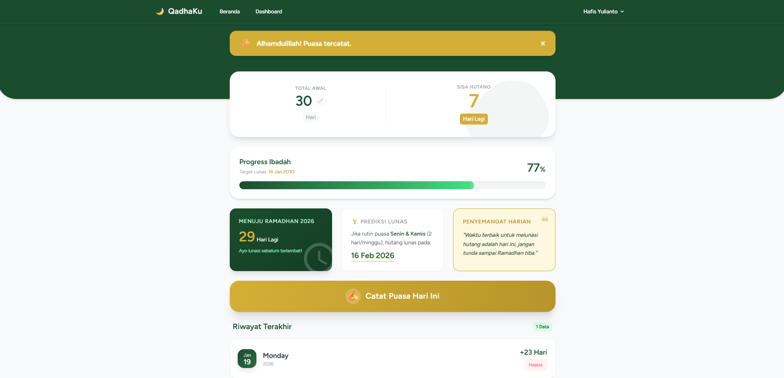
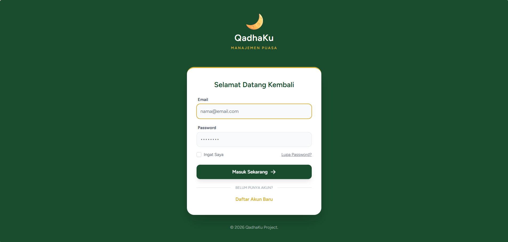

# 🌙 QadhaKu - Aplikasi Manajemen Hutang Puasa

**QadhaKu** adalah aplikasi berbasis web yang membantu umat Muslim mencatat, memantau, dan menyelesaikan kewajiban hutang puasa (Qadha) mereka dengan antarmuka yang modern, bersih, dan bernuansa Islami.

Dibuat sebagai proyek *Full Stack Web Development* menggunakan framework **Laravel**.

## 🚀 Fitur Utama

-   **Dashboard Premium:** Desain UI modern dengan nuansa Hijau & Emas (Islamic Gold).
-   **Smart Tracking:** Sistem otomatis menghitung sisa hutang berdasarkan total awal dikurangi riwayat puasa.
-   **Widget Dinamis:**
    -   📅 **Countdown Ramadhan:** Menghitung mundur hari menuju Ramadhan secara otomatis (Support hingga tahun 2030+).
    -   💡 **Prediksi Lunas:** Estimasi tanggal lunas jika rutin puasa Senin-Kamis.
    -   🕌 **Daily Quotes:** Kata mutiara Islami yang berganti setiap refresh.
-   **Manajemen Riwayat:** Catat dan hapus riwayat puasa dengan validasi aman.
-   **Mobile First:** Tampilan responsif dan nyaman digunakan di HP (Android/iOS).
-   **Secure Profile:** Fitur update profil, ganti password, dan hapus akun permanen.

## 🛠️ Teknologi yang Digunakan

-   **Backend:** Laravel (PHP Framework)
-   **Frontend:** Blade Templating, Tailwind CSS
-   **Interactivity:** Alpine.js (Untuk Modal & Dropdown)
-   **Database:** MySQL

## 📸 Screenshots
## 📸 Screenshots

| Dashboard Utama | Mode Edit |
| :---: | :---: |
|  |  |

**Tampilan Login:**


## 📦 Cara Install (Local)

1.  Clone repository ini:
    ```bash
    git clone [https://github.com/USERNAME_KAMU/qadhaku-app.git](https://github.com/USERNAME_KAMU/qadhaku-app.git)
    ```
2.  Masuk ke folder project:
    ```bash
    cd qadhaku-app
    ```
3.  Install dependencies:
    ```bash
    composer install
    npm install
    ```
4.  Copy file .env:
    ```bash
    cp .env.example .env
    ```
5.  Generate Key & Migrate Database:
    ```bash
    php artisan key:generate
    php artisan migrate
    ```
6.  Jalankan server:
    ```bash
    npm run dev
    php artisan serve
    ```

---
Dibuat dengan ❤️ oleh **Hafis Yulianto**.